# ROOTÉ.US — User Flows

Companion to [`DESIGN-SPECIFICATION.md`](./DESIGN-SPECIFICATION.md). Flows describe **implemented behaviour** (route guards, state transitions, error paths) unless a step is marked `GAP` / `stub`. Rule references point to [`BUSINESS-RULES.md`](./BUSINESS-RULES.md).

Legend for the diagrams: rectangles = screen/state, diamonds = decision, rounded = terminal, `» text` on an edge = system response.

---

## UF-01 — First-time visitor → diagnosis → report

**Start:** any marketing page. **Success:** the personalized report. **Actor:** anonymous visitor.

```mermaid
flowchart TD
    A[Marketing page] -->|"Start Free Diagnosis"| B["/diagnosis (intro)"]
    B -->|Continue| C["/diagnosis/gender"]
    C -->|Select Male/Female » session.diagnosis.gender set| D["/diagnosis/photos"]
    D -->|Add 4 angle photos » blobs to IndexedDB, thumbs to state| E{All 4 photos present?}
    E -->|No| D
    E -->|Yes » Continue| F["/diagnosis/analyzing"]
    F -->|Answer Q1..Q5 + analyzing strip completes| G{All 5 answered AND on finalize view?}
    G -->|No| F
    G -->|Yes » reportId = randomUUID(); deriveAnalysis(); session.analysis set| H["/diagnosis/ready"]
    H -->|Enter email| I{Valid email?}
    I -->|No » inline error| H
    I -->|Yes » session.account.email set; TODO email backend| J["/report/:reportId"]
    J --> K((Report shown))
```

Notes: with `VITE_HAIRHEALTH_API_URL` set and photos available, step G runs `analyzeHair` (async) instead of the synchronous local path (BR-AN-11); on any failure it falls back to `deriveAnalysis` and still lands on `/diagnosis/ready`.

---

## UF-02 — Diagnosis step guards & resume

**Purpose:** what happens on direct URL entry / refresh. **Source:** `redirectForStep` (`src/app/routes/diagnosis/guards.ts`).

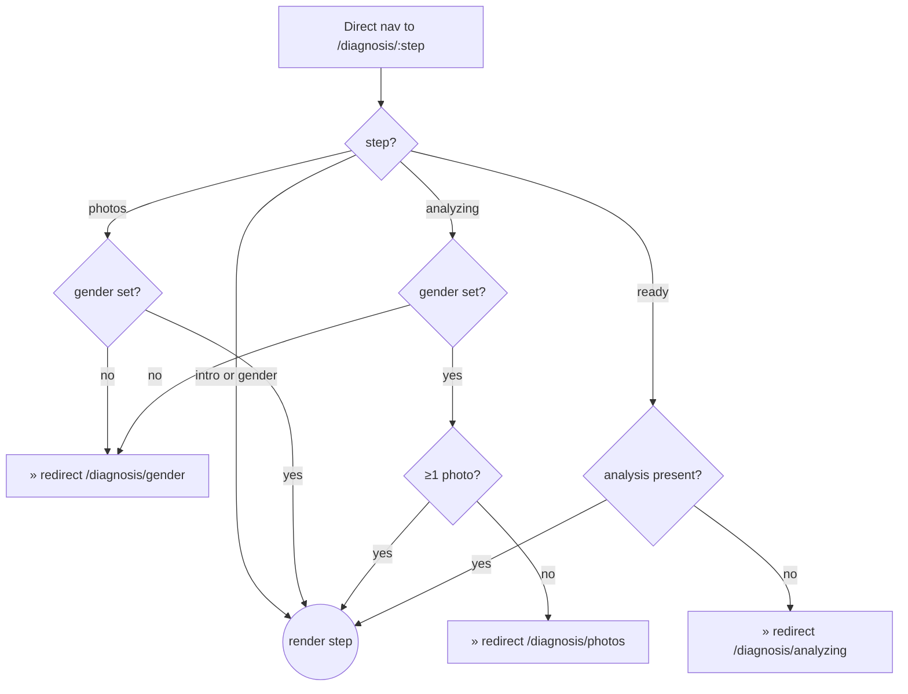

- Refresh mid-questionnaire: answers persist (`sessionStore`), the local step counter resets to 0 but answered questions are pre-filled and the strip re-gates on `allAnswered`.
- The guard needs **≥1** photo, but `/diagnosis/photos` won't let you *continue* without **4** (BR conflict → OQ-UX-1). So the "analyzing with 1–3 photos" state is only reachable by typing the URL.

---

## UF-03 — Photo capture

**Source:** `PhotoUpload.tsx`, `downscaleImage.ts`, `persistence.ts`. Rules: BR-MD-01…04.

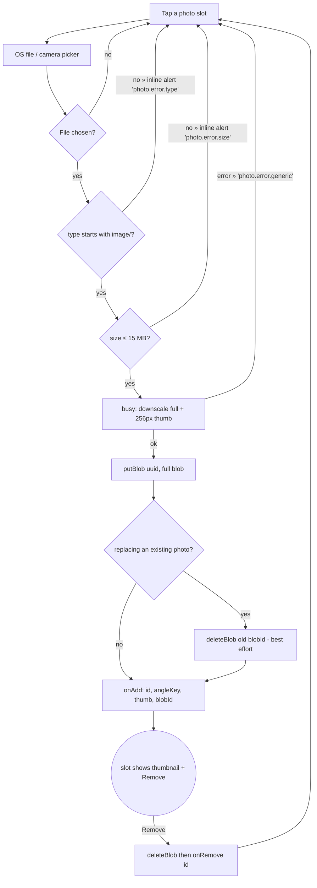

---

## UF-04 — Analyzing + questionnaire (gated dual progress)

**Source:** `AnalyzingStep.tsx`, `AnalyzingStrip`, `QuestionCard`. Rule: BR-AN, FR-028/029.

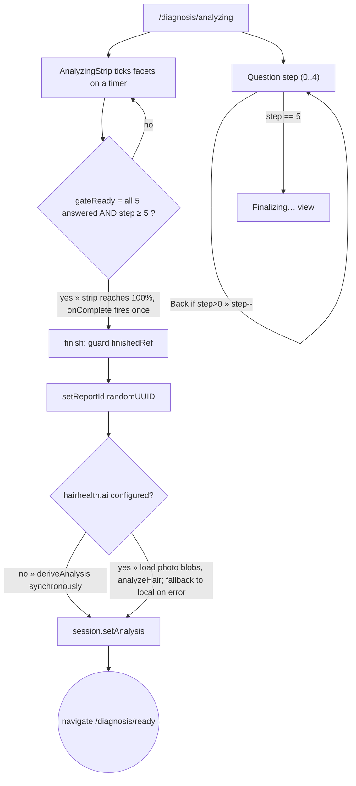

Reduced motion: enter/slide transitions disabled; content static.

---

## UF-05 — Email capture → report

**Source:** `ReadyStep.tsx`. Rule: FR-033/034.

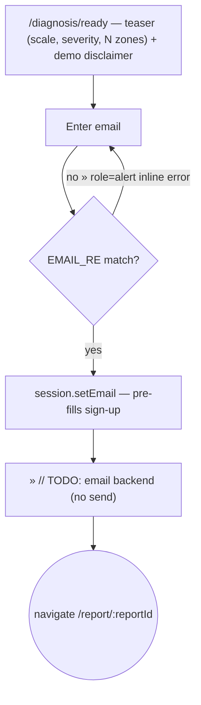

---

## UF-06 — Report view / not found

**Source:** `ReportPage.tsx`, `ReportView.tsx`, `ReportNotFound.tsx`. Rules: BR-RP, FR-036.

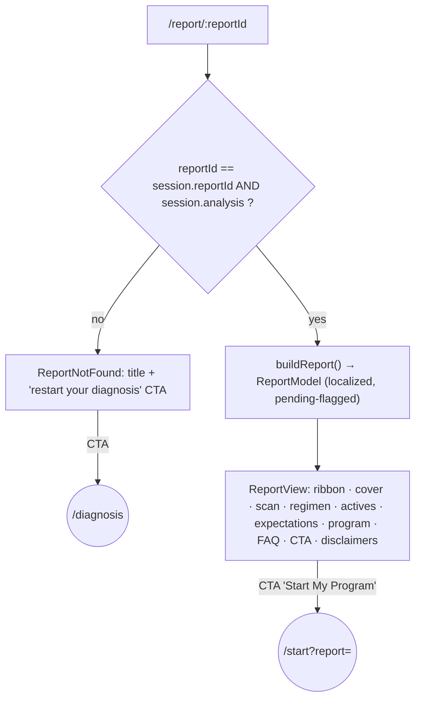

Unverified values (prices, effectiveness, timing, follow-up cost, m1/m3/m6 outcomes) render as `[PENDING: …]` chips (BR-PD-02).

---

## UF-07 — Account → plan → checkout → success → app

**Source:** `StartLayout.tsx`, `AccountStep`, `PlanStep`, `CheckoutStep`, `SuccessStep`, `redirectForStartStep`. Rules: BR-AU-08, BR-PR-02/03, BR-CO-01…05.

```mermaid
flowchart TD
    Entry["/start?report=<id>"] --> R{report resolvable? (session.reportId + analysis, matches ?report)}
    R -->|no| NR["'no report' state (+ DEV seed button)"]
    NR -->|DEV seed| Entry
    R -->|yes| G0{signed in?}
    G0 -->|yes| PLAN
    G0 -->|no| ACC["/start (account): email + password"]
    ACC -->|submit| V{valid email? pw ≥ 8? not duplicate?}
    V -->|no » inline error| ACC
    V -->|yes » auth.signUp; session.setEmail| PLAN["/start/plan"]
    PLAN --> P0["Recommended duration pre-selected + badged; 5 rows (prices [PENDING])"]
    P0 -->|choose duration » session.draftDurationDays| P0
    P0 -->|Continue| CHK{draftDurationDays set?}
    CHK -->|no| PLAN
    CHK -->|yes| CO["/start/checkout: summary + contact + card form + 'test UI' notice"]
    CO -->|submit| CV{card shape valid? (13-19 / MM/YY / 3-4)}
    CV -->|no » inline error| CO
    CV -->|yes| SP[submitPayment stub ~400ms]
    SP -->|throw (DEV forced)| CE["inline payment error; nothing saved"]
    CE --> CO
    SP -->|success| BP["buildProgram(): start=today, end=+durationDays, plan+analysis frozen; session.setProgram"]
    BP --> SU["/start/success: order id, duration, start date, 3 next steps"]
    SU -->|"CTA 'Go to my program'"| APP(("/app"))
```

Re-entry rules: signed in at `/start` → `/start/plan`; any `/start/*` with a `Program` already set → `/start/success`; `/start/*` while signed out → `/start`.

---

## UF-08 — Returning user sign-in (`/login`)

**Source:** `LoginPage.tsx`, `auth.signIn`. Rules: BR-AU-06/08.

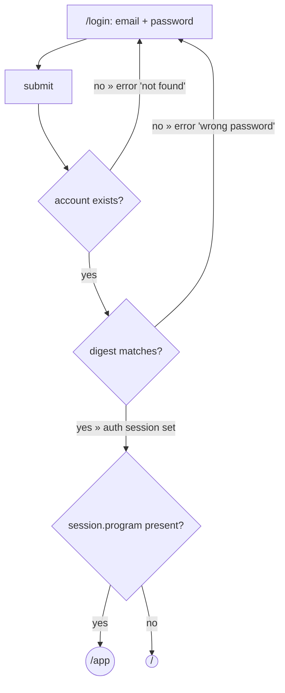

`/login` also linked from `/start` (account step) via "Sign in instead".

---

## UF-09 — Post-purchase daily loop (Today)

**Source:** `AppShell`, `AppToday`, `programProgress.ts`. Rules: BR-PR-04/05/07/09.

```mermaid
flowchart TD
    A["Open /app"] --> G{session.program? }
    G -->|no| H(("redirect /"))
    G -->|yes| I{auth.email?}
    I -->|no| J(("redirect /login"))
    I -->|yes| K["Today: 'Day D of total', progress bar, KPI strip (checklist / adherence% / next order)"]
    K --> L["Routine checklist: core + supporting tasks (core:N / support:N)"]
    L -->|toggle a task » completionLog[today] gains/loses key; label strikethrough| L
    K --> M{isReorderDue? (daysRemaining ≤ 21 or ended)}
    M -->|yes| N["Reorder card » CTA /start/plan"]
    M -->|no| O["(no reorder card)"]
    K --> P["Reminders card: 'coming soon' (stub, no scheduling)"]
```

---

## UF-10 — Progress photos & re-scan

**Source:** `AppProgress.tsx`, `AppRescan.tsx`. Rules: BR-PR-06/13.

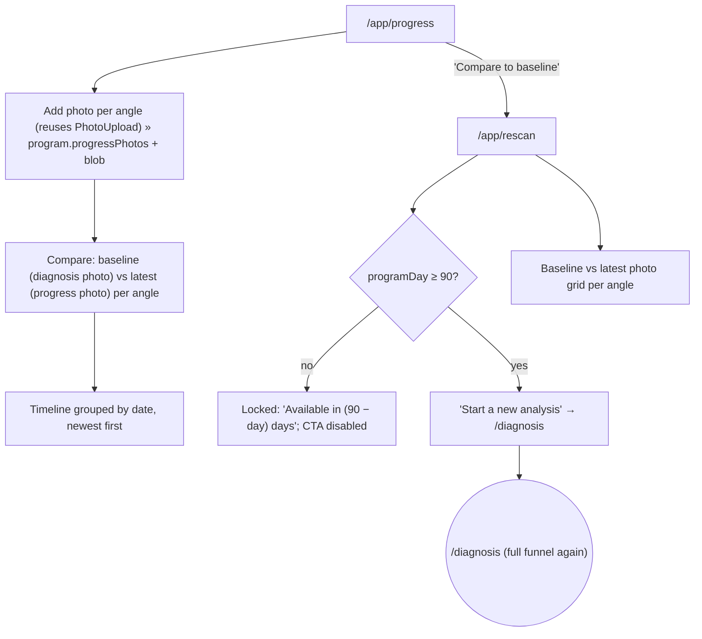

`GAP`: no `deriveRescan` delta / Before/After metric comparison (FR-074).

---

## UF-11 — Care-team messages

**Source:** `AppCare.tsx`, `CARE_MESSAGES`. Rule: BR-PR-08.

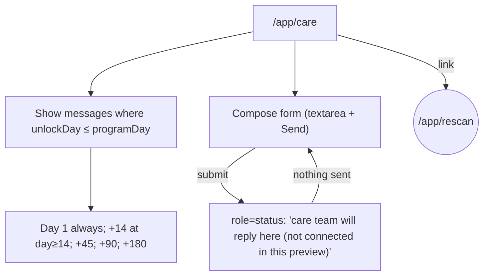

---

## UF-12 — Reorder / renewal prompt

**Source:** `isReorderDue`, `reorderDate`, `AppToday`. Rule: BR-PR-05.

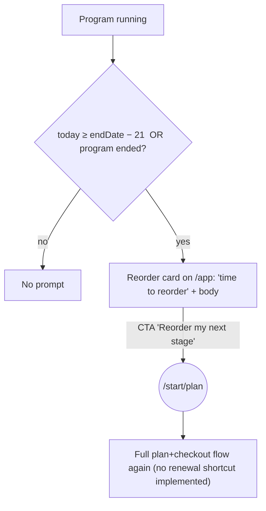

---

## UF-13 — Product shop → bag → stubbed checkout → success

**Source:** `Products.tsx`, `cart.tsx`, `BagPage`, `BagCheckout`, `BagSuccess`. Rules: BR-CO-06/07.

```mermaid
flowchart TD
    A["/products (17 SKUs, category filter)"] -->|"Add to bag" » cart.add(sku), qty clamp 1–20, 'Added' flash| A
    A -->|nav| B["/bag: line items, qty steppers, remove; prices [PENDING]; summary [PENDING]"]
    B -->|empty| C["Empty state + 'Browse products'"]
    B -->|"Checkout"| D["/bag/checkout: contact + card form + summary"]
    D -->|empty cart & not placed| E(("redirect /bag"))
    D -->|submit| F{card shape valid?}
    F -->|no » inline error| D
    F -->|yes| G[submitPayment stub ~400ms]
    G -->|throw (DEV forced)| H["inline payment error"]
    H --> D
    G -->|success| I["setPlaced; navigate /bag/success (state.orderId); cart.clear()"]
    I --> J["/bag/success: 'bag-…' order id + next steps + links to /products, /"]
    J -->|no state.orderId on direct visit| K(("redirect /products"))
```

---

## UF-14 — Locale toggle

**Source:** `LocaleProvider`, `LocaleToggle`. Rules: BR-LO-01…06.

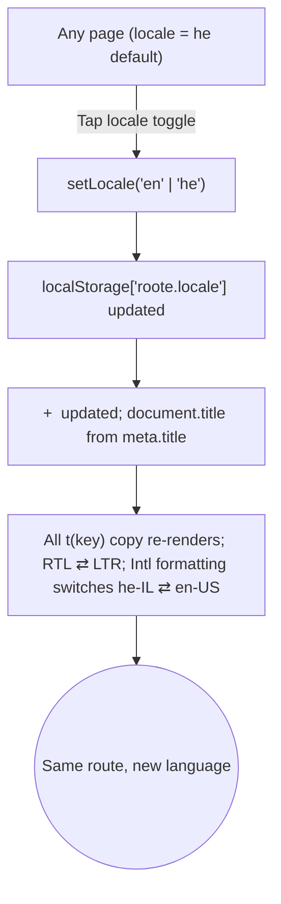

---

## UF-15 — Error recovery

Consolidated failure/edge paths (all implemented unless noted).

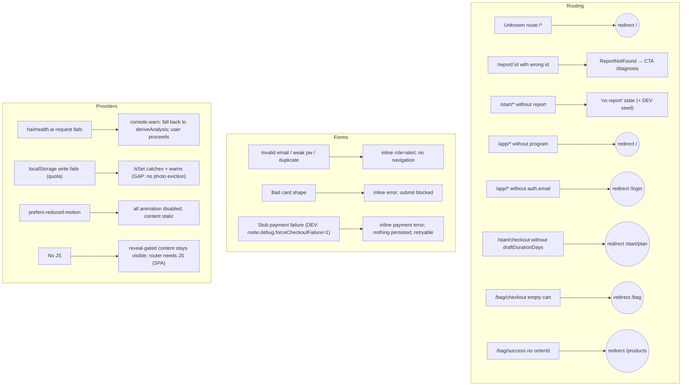

---

## Flow coverage vs. requirements

| Flow | Primary FR | Business rules |
|---|---|---|
| UF-01 | FR-021…FR-035 | BR-AN-* |
| UF-02 | FR-030, FR-035 | — |
| UF-03 | FR-025, FR-026 | BR-MD-01…04 |
| UF-04 | FR-028, FR-029, FR-031, FR-032 | BR-AN-11 |
| UF-05 | FR-033, FR-034 | — |
| UF-06 | FR-036…FR-044 | BR-RP-*, BR-PD-* |
| UF-07 | FR-046…FR-060 | BR-AU-08, BR-PR-02/03, BR-CO-01…05 |
| UF-08 | FR-046a…FR-048a | BR-AU-06/08 |
| UF-09 | FR-061…FR-066, FR-076…FR-079 | BR-PR-04/07/09 |
| UF-10 | FR-068…FR-074 | BR-PR-06/13 |
| UF-11 | FR-070, FR-071 | BR-PR-08 |
| UF-12 | FR-065, FR-078 | BR-PR-05 |
| UF-13 | FR-011a…FR-020a | BR-CO-06/07 |
| UF-14 | FR-081, FR-082 | BR-LO-01…06 |
| UF-15 | FR-030, FR-057, FR-088, NFR-010, NFR-020 | BR-CO-03, BR-MD-05, BR-LO-05 |
